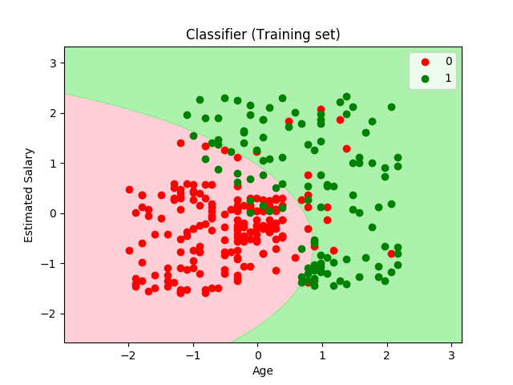

# Machine Learning Basics

Parte da disciplina de Deep Learning da escola de Engenharia de Software da UnB, material usado na aula 02.

## Classificador Naive Bayes 
É uma técnica de classificação baseada no Teorema de Bayes, com uma suposição de independência entre os preditores. Em termos simples, um classificador Naive Bayes assume que a presença de um recurso em particular em uma classe não está relacionada à presença de qualquer outro recurso. Mesmo que esses recursos dependam um do outro ou da existência de outros recursos, todas essas propriedades contribuem independentemente para a probabilidade. O modelo ingênuo de Bayes é fácil de construir e particularmente útil para conjuntos de dados muito grandes. Juntamente com a simplicidade, sabe-se que o Naive Bayes supera até os métodos de classificação altamente sofisticados.

## Resultado

## Referências
<https://medium.com/@Mandysidana/machine-learning-types-of-classification-9497bd4f2e14>
